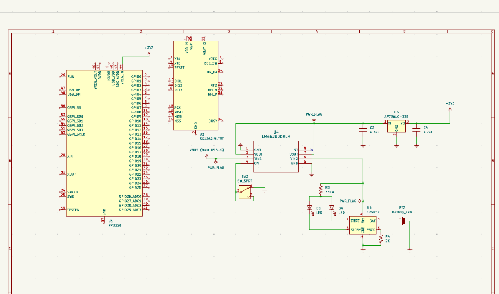

# Battery + USB-C + Switch Power Schematic

This schematic in this repository explains how one would implement power in a PCB:
- An optional Li-Ion battery can be connected
- USB-C (usb3) can be connected

If USB is connected, it will charge the battery. It will also provide 3.3v through the voltage regulator.

There are two status LEDs that are provided that show when the battery is charging and when the battery is not charging (standby).

A microcontroller is also inserted to show as an example of how it would be powered by the `3v3` pin that is provided as an output by the voltage regulator.

